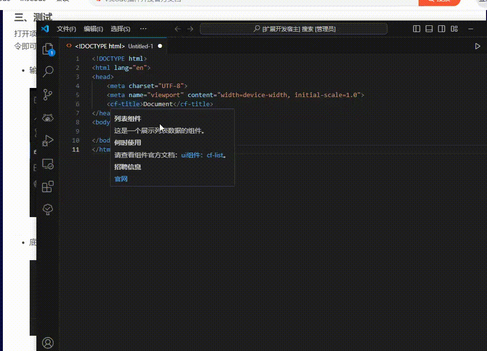
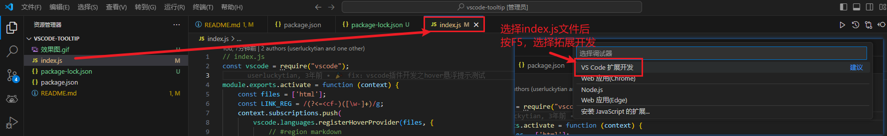

# 做了什么?

实现了一个针对html文件中 以<cf-xxx></cf-xxx>开头的标签 的 鼠标悬浮效果。
只要标签的开头部分是`cf-`,就会被捕获，并展示预设置好的悬浮内容。

# 效果图：

# 克隆代码后，如何本地运行起来?

# 进阶

1. 根据自己的需求，去开发命令类型的功能，还是展示类型的功能
2. 以上都需要自己去看vscode拓展工具开发文档，这里仅是演示。

# 参考文献：

1. [开发一个 vscode 图片悬停预览插件](https://blog.csdn.net/weixin_40203158/article/details/117650153)
2. [Infragistics Ignite UI for Angular Tooltips](https://marketplace.visualstudio.com/items?itemName=Infragistics.igniteui-angular-tooltips&ssr=false#overview)
3. [How to apply styling and html tags on hover message with vscode API?](https://stackoverflow.com/questions/67749752/how-to-apply-styling-and-html-tags-on-hover-message-with-vscode-api)
